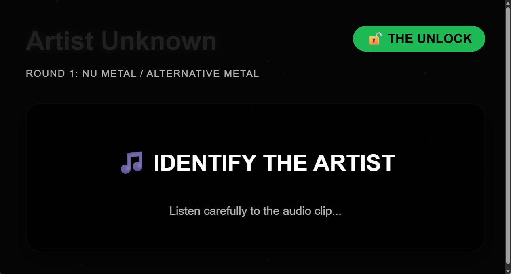

# 🎵 The Artist Unlocked

**The Artist Unlocked** is an interactive, AI-powered music trivia platform designed for hosting high-energy quiz nights. Built with Electron and React, it combines the power of **Google Gemini AI** for trivia generation and **Spotify** for real-time music integration.

Whether you're hosting a casual night with friends or a competitive superfan showdown, "The Artist Unlocked" creates a professional, thematic experience with dynamic visuals and a mobile remote control.



## 🎮 Game Mechanics

"The Artist Unlocked" follows a structured competitive format:

- **Rounds:** 5 Artists per quiz. Each artist represents one full round.
- **Phase 1: The Unlock:** Identifying the artist via a short audio clip (10 pts).
- **Phase 2: The Lore Ladder:** 5 tiers of questions per artist, escalating in difficulty and points:
    - **Tier 1:** 10 pts
    - **Tier 2:** 20 pts
    - **Tier 3:** 30 pts
    - **Tier 4:** 40 pts
    - **Tier 5:** 50 pts
- **🔥 The All-In Token:** Each team has one "All-In" token per game. Use it on any question to double the points earned if correct. Use it wisely!
- **💰 The Final Wager:** Triggers on the Tier 5 question of the final artist. Teams can wager any amount of their total current score. A correct answer adds the wager; an incorrect one deducts it.

## ✨ Key Features

- **🤖 AI Trivia Generator:** Uses Google Gemini to generate unique "Lore Ladders" for any artist in seconds.
- **🎧 Spotify Integration:** Seamlessly search for and play tracks during the quiz.
- **📱 Mobile Remote:** Control the entire game from your smartphone via a local Socket.io server.
- **🎭 Dynamic Themes:** Genre-based visual themes (colors, animations, and fonts) generated by AI.
- **🏆 Advanced Game Mechanics:** Includes an "All-In" token for doubling points and a "Final Wager" phase for a dramatic finish.
- **🖥️ Dual Screen Experience:** A private Quizmaster Dashboard and a public-facing Presentation Screen.

## 🚀 Getting Started

### Prerequisites

- **Node.js** (v18.x or higher)
- **pnpm** (v10.x or higher) — install via `pnpm install -g pnpm` or see [pnpm.io](https://pnpm.io/installation)
- **Google Gemini API Key** (Get one from [Google AI Studio](https://aistudio.google.com/))
- **Spotify Developer Credentials** (Create an app at [Spotify Developer Dashboard](https://developer.spotify.com/dashboard))

### Installation

1. **Clone the repository:**
   ```bash
   git clone https://github.com/your-username/the-artist-unlocked.git
   cd the-artist-unlocked
   ```

2. **Install dependencies:**
   ```bash
   pnpm install
   ```

3. **Run in development mode:**
   ```bash
   pnpm dev
   ```

4. **Configure your keys:**
   Open the app and navigate to the **🔐 Config** tab to enter your Gemini and Spotify credentials. They will be encrypted and stored locally.

### Building for Production

To package the application for your OS (Windows, macOS, or Linux):

```bash
pnpm build
# Then use electron-builder (ensure configuration in package.json)
npx electron-builder
```

## 🛠️ Tech Stack

- **Shell:** [Electron](https://www.electronjs.org/)
- **Frontend:** [React 19](https://react.dev/), [Vite](https://vitejs.dev/)
- **AI:** [Google Gemini API](https://ai.google.dev/)
- **Music:** [Spotify Web API](https://developer.spotify.com/documentation/web-api/)
- **Real-time Sync:** [Socket.io](https://socket.io/), [Express](https://expressjs.com/)
- **Visuals:** [tsparticles](https://particles.js.org/)

## 📄 License

This project is licensed under the **MIT License** - see the [LICENSE](LICENSE) file for details.

## 🌍 Credits

- [Music icons created by Freepik - Flaticon](https://www.flaticon.com/free-icons/music)
- Artwork and metadata provided by [Fanart.tv](https://fanart.tv). Users can optionally get their own personal API key for faster image access.

---

Created with ❤️ by **Janus Klok Matthesen**.
